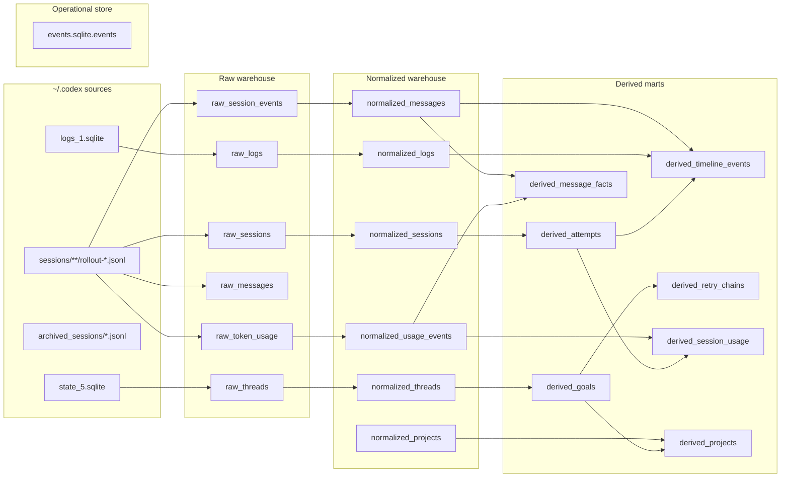

# History Pipeline

Use this as the quick map for transcript, usage, and derived-history work.

## Read Order

1. `src/codex_metrics/history_ingest.py`
2. `src/codex_metrics/history_normalize.py`
3. `src/codex_metrics/history_derive.py`
4. `src/codex_metrics/history_compare.py`

## Raw Sources In `~/.codex`

- `state_5.sqlite`
- `sessions/**/rollout-*.jsonl`
- `archived_sessions/*.jsonl`
- `logs_1.sqlite`

## Relationship Map



`events.sqlite.events` is a separate operational audit store, not part of the transcript warehouse.

## Raw Warehouse Tables

### Catalog

#### `raw_threads`

Thread-level metadata from `state_5.sqlite`.

- Primary key: `thread_id`
- Use for: thread identity, model, cwd, title, archival state, rollout path
- Important note: this table does not store usage cost; join on `thread_id` when you need tokens or pricing

#### `raw_sessions`

One row per rollout session file.

- Primary key: `session_path`
- Use for: source rollout file, session timestamp, cwd, source, CLI metadata
- Join key: `thread_id`

#### `raw_session_events`

Every JSONL event in session order.

- Primary key: `event_id`
- Use for: the full raw event stream when you need non-message events such as `task_started`, `turn_context`, `response_item`, or `token_count`
- Important note: this is the most verbose source; prefer the more specific raw tables when possible

#### `raw_messages`

Parsed developer, user, and assistant text extracted from `response_item`.

- Primary key: `message_id`
- Use for: transcript search, message ordering, conversation reconstruction
- Join keys: `thread_id`, `session_path`, `event_index`
- Important note: this is usually the first table to query for history search

#### `raw_token_usage`

Parsed token usage rows from `token_count` events.

- Primary key: `token_event_id`
- Use for: input, cached input, output, reasoning, and total tokens
- Join keys: `thread_id`, `session_path`, `event_index`
- Important note: `model` is currently not populated here in this warehouse; use `raw_threads.model` or `normalized_threads.model` when you need model attribution

#### `raw_logs`

Runtime/log side-channel rows from `logs_1.sqlite`.

- Primary key: `(source_path, row_id)`
- Use for: task boundary traces, debug logs, model hints, and any side-band evidence not present in rollout JSONL
- Join key: `thread_id`

## Normalized Tables

#### `normalized_threads`

Thread metadata after normalization.

- Primary key: `thread_id`
- Use for: cleaned thread attributes plus derived counts such as session/message/log totals

#### `normalized_sessions`

Session metadata after normalization.

- Primary key: `session_path`
- Use for: canonical session-level metadata and ordering

#### `normalized_messages`

Message rows after normalization.

- Primary key: `message_id`
- Use for: stable transcript search and turn reconstruction

#### `normalized_usage_events`

Token usage rows after normalization.

- Primary key: `usage_event_id`
- Use for: stable usage accounting before derived aggregation

#### `normalized_logs`

Log rows after normalization.

- Primary key: `(source_path, row_id)`
- Use for: cleaned log analysis and thread-level tracing

#### `normalized_projects`

Project-level aggregate after normalization.

- Primary key: `project_cwd`
- Use for: counts by project root before higher-level goal derivation

## Derived Tables

#### `derived_goals`

One row per thread/goal.

- Primary key: `thread_id`
- Use for: the main unit of product analysis
- Fields to watch: `attempt_count`, `retry_count`, `message_count`, `usage_event_count`, `timeline_event_count`, `model`

#### `derived_attempts`

One row per session attempt inside a thread.

- Primary key: `attempt_id`
- Use for: retry analysis and session-level comparison
- Join keys: `thread_id`, `session_path`

#### `derived_timeline_events`

Compressed timeline view of the full thread.

- Primary key: `timeline_event_id`
- Use for: ordered reconstruction of what happened over time

#### `derived_message_facts`

Message-level OLAP fact table with token usage attributed to the nearest assistant turn, the resolved model, and a derived message date.

- Primary key: `message_id`
- Use for: Metabase-friendly message analysis, token-by-message reporting, model slicing, and date slicing
- Join keys: `thread_id`, `session_path`, `event_index`

#### `derived_retry_chains`

Retry-chain summary per thread.

- Primary key: `thread_id`
- Use for: whether the thread experienced retry pressure and which attempt was first/last

#### `derived_session_usage`

Session-level usage aggregates.

- Primary key: `session_usage_id`
- Use for: cost analysis per dialogue/session usage aggregate
- Join keys: `thread_id`, `session_path`, `attempt_index`

#### `derived_projects`

Project-level aggregate after derivation.

- Primary key: `project_cwd`
- Use for: project comparison across threads, attempts, tokens, and timeline volume

## Event Store

- `events.sqlite.events`: audit log of `codex-metrics` operations and goal mutations
- Use for: bookkeeping, retros, and tracing changes to metrics state
- Important note: this is not the transcript/history warehouse

## Stable Identifiers

- `thread_id`: top-level conversation/thread identity
- `session_path`: source rollout file for one session
- `turn_id`: per-turn identifier found in `task_started` and `turn_context` events
- `event_index`: raw JSONL line order within a session
- `message_id`: deterministic id for a parsed message row
- `usage_event_id`: deterministic id for a token usage event
- `timeline_event_id`: deterministic id for derived timeline rows

## Practical Search Workflow

1. Ingest local `~/.codex` sources into the raw warehouse.
2. Normalize raw rows into stable message, usage, and project tables.
3. Derive higher-level goal, attempt, and timeline marts.
4. Search `raw_messages` or `normalized_messages` for transcript text.
5. Use `thread_id`, `session_path`, and `turn_id` to group related context.
6. Use `raw_token_usage` or `normalized_usage_events` when the question is about cost or token mix.
7. Use `derived_message_facts` when the question is about message-level OLAP analysis or token spend by message date.
8. Use `derived_goals` and `derived_projects` when the question is about project-level comparison.

## Useful Query Shapes

- Search the transcript text:

```sql
SELECT thread_id, session_path, role, text
FROM raw_messages
WHERE text LIKE '%keyword%'
ORDER BY thread_id, session_path, event_index, message_index;
```

- Find usage for a turn or session:

```sql
SELECT thread_id, session_path, input_tokens, cached_input_tokens, output_tokens, total_tokens
FROM raw_token_usage
WHERE thread_id = ? OR session_path = ?
ORDER BY event_index;
```

- Inspect message-level token facts:

```sql
SELECT message_date, model, role, text, total_tokens
FROM derived_message_facts
WHERE thread_id = ?
ORDER BY message_timestamp, event_index, message_index;
```

- Inspect the derived project slice:

```sql
SELECT project_cwd, thread_count, attempt_count, message_count, usage_event_count, total_tokens
FROM derived_projects
ORDER BY thread_count DESC, attempt_count DESC, project_cwd ASC;
```

## Notes

- `raw_messages` is already present and is the first place to look for transcript text.
- Do not add a new message table unless the current pipeline cannot represent the question.
- For new search features, prefer a read-only CLI over new storage unless the new storage is clearly the bottleneck.
