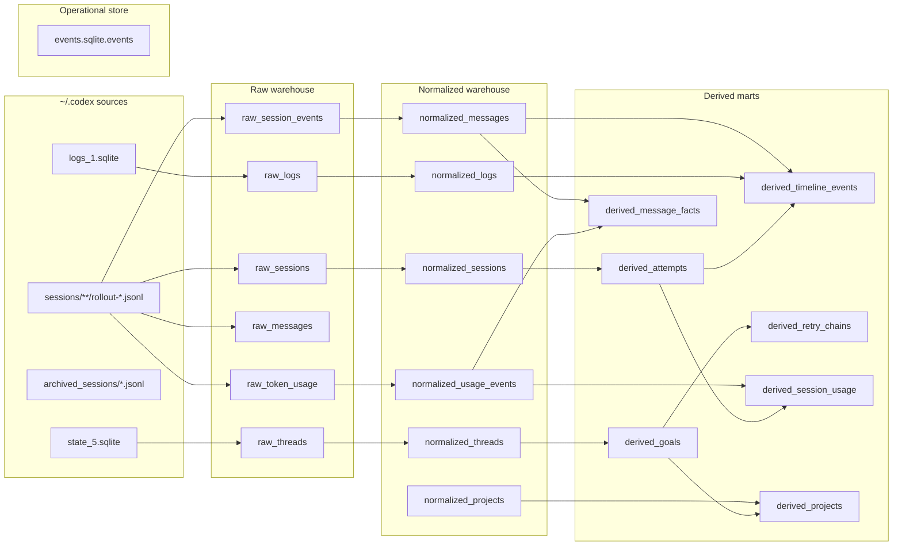

# History Pipeline

**What this document is:** How `ai-agents-metrics` reconstructs past goal and attempt history from raw AI agent session data. This is an implementation-specific ingestion layer — it describes the current adapters, not the product model.

**When to read this:**
- Working on history ingestion or transcript analysis
- Adding a new data source adapter
- Debugging data reconstruction or gaps between recorded goals and agent sessions

**Related docs:**
- [architecture.md](architecture.md) — where the history pipeline fits in the overall system
- [data-schema.md](data-schema.md) — the GoalRecord / AttemptEntryRecord model this pipeline feeds into
- [data-invariants.md](data-invariants.md) — business rules for reconstructed records

---

## Scope and limitations

This pipeline currently reads from **local Codex agent files** (`~/.codex`). It is one way to feed historical data into the metrics system — not the only way, and not a required part of normal metrics tracking.

The product model (goals, attempts, outcomes, cost) is source-agnostic. This pipeline is an adapter layer for one current source. New sources would follow the same ingest → normalize → derive pattern but with different raw tables and source readers.

---

## Pipeline overview

```
Raw sources (~/.codex)
  ↓  ingest       → raw warehouse tables (SQLite)
  ↓  normalize    → cleaned, stable rows
  ↓  derive       → goal/attempt/timeline marts
  ↓  compare      → diff against metrics ledger (events.ndjson)
```

| Stage | Module | What it does |
|-------|--------|--------------|
| Ingest | `history_ingest.py` | Reads raw Codex sources into the warehouse |
| Normalize | `history_normalize.py` | Cleans and stabilises raw rows |
| Derive | `history_derive.py` | Builds goal, attempt, and timeline marts |
| Compare | `history_compare.py` | Diffs derived goals against the NDJSON ledger |

Run in order: ingest → normalize → derive → compare.

---

## Raw Sources (`~/.codex`)

The current adapter reads four source files:

| Source | Content |
|--------|---------|
| `state_5.sqlite` | Thread-level metadata: model, cwd, title, archival state |
| `sessions/**/rollout-*.jsonl` | Full event stream per session: messages, token counts, task events |
| `archived_sessions/*.jsonl` | Same format as active sessions, post-archival |
| `logs_1.sqlite` | Runtime log side-channel: task boundaries, debug traces, model hints |

---

## Relationship Map



`events.sqlite.events` is a separate operational audit store written by `observability.py` — not part of the transcript warehouse.

---

## Raw Warehouse Tables

### `raw_threads`

Thread-level metadata from `state_5.sqlite`.

- Primary key: `thread_id`
- Use for: thread identity, model, cwd, title, archival state, rollout path
- Note: does not store usage cost; join on `thread_id` to get tokens or pricing

### `raw_sessions`

One row per rollout session file.

- Primary key: `session_path`
- Join key: `thread_id`
- Use for: source rollout file, session timestamp, cwd, source, CLI metadata

### `raw_session_events`

Every JSONL event in session order.

- Primary key: `event_id`
- Use for: the full raw event stream when you need non-message events such as `task_started`, `turn_context`, `response_item`, or `token_count`
- Note: most verbose source; prefer more specific raw tables when possible

### `raw_messages`

Parsed developer, user, and assistant text extracted from `response_item`.

- Primary key: `message_id`
- Join keys: `thread_id`, `session_path`, `event_index`
- Use for: transcript search, message ordering, conversation reconstruction
- Note: usually the first table to query for history search

### `raw_token_usage`

Parsed token usage rows from `token_count` events.

- Primary key: `token_event_id`
- Join keys: `thread_id`, `session_path`, `event_index`
- Use for: input, cached input, output, reasoning, and total tokens
- Note: `model` is not populated here; use `raw_threads.model` or `normalized_threads.model` for model attribution

### `raw_logs`

Runtime/log side-channel rows from `logs_1.sqlite`.

- Primary key: `(source_path, row_id)`
- Join key: `thread_id`
- Use for: task boundary traces, debug logs, model hints, and any side-band evidence not in rollout JSONL

---

## Normalized Tables

### `normalized_threads`

Thread metadata after normalization.

- Primary key: `thread_id`
- Use for: cleaned thread attributes plus derived counts (session/message/log totals)

### `normalized_sessions`

Session metadata after normalization.

- Primary key: `session_path`
- Use for: canonical session-level metadata and ordering

### `normalized_messages`

Message rows after normalization.

- Primary key: `message_id`
- Use for: stable transcript search and turn reconstruction

### `normalized_usage_events`

Token usage rows after normalization.

- Primary key: `usage_event_id`
- Use for: stable usage accounting before derived aggregation

### `normalized_logs`

Log rows after normalization.

- Primary key: `(source_path, row_id)`
- Use for: cleaned log analysis and thread-level tracing

### `normalized_projects`

Project-level aggregate after normalization.

- Primary key: `project_cwd`
- Use for: counts by project root before higher-level goal derivation

---

## Derived Tables

### `derived_goals`

One row per thread/goal.

- Primary key: `thread_id`
- Use for: the main unit of product analysis
- Key fields: `attempt_count`, `retry_count`, `message_count`, `usage_event_count`, `timeline_event_count`, `model`

### `derived_attempts`

One row per session attempt inside a thread.

- Primary key: `attempt_id`
- Join keys: `thread_id`, `session_path`
- Use for: retry analysis and session-level comparison

### `derived_timeline_events`

Compressed timeline view of the full thread.

- Primary key: `timeline_event_id`
- Use for: ordered reconstruction of what happened over time

### `derived_message_facts`

Message-level OLAP fact table with token usage attributed to the nearest assistant turn, the resolved model, and a derived message date.

- Primary key: `message_id`
- Join keys: `thread_id`, `session_path`, `event_index`
- Use for: token-by-message reporting, model slicing, date slicing

### `derived_retry_chains`

Retry-chain summary per thread.

- Primary key: `thread_id`
- Use for: whether the thread experienced retry pressure and which attempt was first/last

### `derived_session_usage`

Session-level usage aggregates.

- Primary key: `session_usage_id`
- Join keys: `thread_id`, `session_path`, `attempt_index`
- Use for: cost analysis per dialogue/session usage aggregate

### `derived_projects`

Project-level aggregate after derivation.

- Primary key: `project_cwd`
- Use for: project comparison across threads, attempts, tokens, and timeline volume

---

## Event Store

`events.sqlite.events` is the audit log of `ai-agents-metrics` CLI operations and goal mutations — written by `observability.py`. It is not part of the transcript/history warehouse and is not produced by this pipeline.

---

## Stable Identifiers

| Identifier | Meaning |
|------------|---------|
| `thread_id` | Top-level conversation/thread identity |
| `session_path` | Source rollout file for one session |
| `turn_id` | Per-turn identifier from `task_started` and `turn_context` events |
| `event_index` | Raw JSONL line order within a session |
| `message_id` | Deterministic id for a parsed message row |
| `usage_event_id` | Deterministic id for a token usage event |
| `timeline_event_id` | Deterministic id for derived timeline rows |

---

## Practical Search Workflow

1. Ingest local `~/.codex` sources into the raw warehouse.
2. Normalize raw rows into stable message, usage, and project tables.
3. Derive higher-level goal, attempt, and timeline marts.
4. Search `raw_messages` or `normalized_messages` for transcript text.
5. Use `thread_id`, `session_path`, and `turn_id` to group related context.
6. Use `raw_token_usage` or `normalized_usage_events` for cost or token questions.
7. Use `derived_message_facts` for message-level OLAP analysis or token spend by date.
8. Use `derived_goals` and `derived_projects` for project-level comparison.

---

## Useful Query Shapes

Search transcript text:

```sql
SELECT thread_id, session_path, role, text
FROM raw_messages
WHERE text LIKE '%keyword%'
ORDER BY thread_id, session_path, event_index, message_index;
```

Find usage for a turn or session:

```sql
SELECT thread_id, session_path, input_tokens, cached_input_tokens, output_tokens, total_tokens
FROM raw_token_usage
WHERE thread_id = ? OR session_path = ?
ORDER BY event_index;
```

Inspect message-level token facts:

```sql
SELECT message_date, model, role, text, total_tokens
FROM derived_message_facts
WHERE thread_id = ?
ORDER BY message_timestamp, event_index, message_index;
```

Inspect derived project slice:

```sql
SELECT project_cwd, thread_count, attempt_count, message_count, usage_event_count, total_tokens
FROM derived_projects
ORDER BY thread_count DESC, attempt_count DESC, project_cwd ASC;
```

---

## Extending the pipeline

To add a new data source (e.g. a different agent or log format):

1. Add a new ingest module that reads from the new source and writes into the same raw warehouse schema, or a new schema alongside it.
2. Add normalize and derive stages that produce the same output table shapes (`derived_goals`, `derived_attempts`, etc.) so downstream comparison and analysis remain unchanged.
3. The compare stage (`history_compare.py`) works against the NDJSON ledger and is source-agnostic — it does not need to change for new sources.

The current raw table names (`raw_threads`, `raw_sessions`, etc.) are Codex-specific. New adapters should introduce their own raw table namespace rather than reusing these names.

---

## Notes

- `raw_messages` is the first place to look for transcript text.
- Do not add a new message table unless the current pipeline cannot represent the question.
- For new search features, prefer a read-only CLI over new storage unless new storage is clearly the bottleneck.
