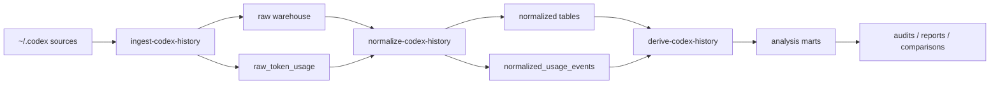

# History-first is the primary product flow; manual tracking is opt-in

Single-hypothesis file.

### H-008 — History-first is the primary product flow; manual tracking is opt-in

- Status: `validated`
- Created: `2026-04-02`
- Updated: `2026-04-12`
- Statement:
  - The primary product value is extracting metrics from existing Claude/Codex conversation history — without requiring any manual instrumentation. The tool's core pitch is: give us your agent history files, and we will show you what happened, what it cost, and where to improve. Manual tracking is an opt-in layer for users who want to add explicit judgements on top of that.

## Parser Architecture

## Reliability Matrix

| Field or signal | Reliability from history | Current source | Notes |
| --- | --- | --- | --- |
| transcript text | `high` | `rollout-*.jsonl` -> `raw_messages` / `normalized_messages` | Full developer, user, and assistant message text is present in observed local history |
| thread/session structure | `high` | `state_5.sqlite`, session rollouts, derived marts | Thread ids, session paths, cwd, and ordering are reconstructable |
| token totals | `high` when `token_count` exists | `raw_token_usage` -> `normalized_usage_events` -> `derived_session_usage` | Current local coverage is strong in observed Codex history |
| token breakdown (`input/cached/output`) | `high` when `last_token_usage` exists, otherwise `partial` | `raw_token_usage` | Some `token_count` events contain only rate-limit noise and no usable breakdown |
| timeline ordering | `high` | timestamps plus event ordering in rollouts/logs | Good enough for reconstruction and audit views |
| retry chains at session level | `medium` | `derived_attempts` / `derived_retry_chains` | Good for observed session boundaries, but not yet a one-to-one replacement for ledger attempt semantics |
| goal boundary | `medium` | inferred from thread/session history | Threads are visible, but one thread is not yet guaranteed to equal one ledger goal |
| task outcome (`success` / `fail`) | `medium` | inferred from history plus comparison to ledger | Sometimes inferable from closure patterns, but not yet authoritative without ledger/live confirmation |
| failure reason | `low-medium` | transcript text and ledger | Useful hints exist in text, but primary failure classification is still better captured live |
| operator `result_fit` judgement | `low` from history alone | ledger only | This is a human/agent review decision, not something we should silently infer as truth |
| supersession / continuation semantics | `low-medium` | ledger plus transcript hints | Possible to infer candidates, but current product contract should still record these explicitly |

## Minimal Live Contract

The current recommended minimal live layer is:

- open and close the goal explicitly in the ledger
- set `goal_type`
- set final `status`
- set explicit `failure_reason` for real failed goals
- set `result_fit` for reviewed product outcomes
- set `supersedes_goal_id` or continuation links when those relationships are intentional

Everything else should be treated as history-first or history-assisted when possible:

- transcript and conversation content
- thread and session structure
- token totals and token breakdown
- timing and timeline reconstruction
- attempt and retry evidence at the session-history level

## Post-Factum Recoverability Rule

When deciding whether a field belongs in the live contract or should be reconstructed later from history, use this rule:

- keep live capture only for fields that are both analytically important and not reliably recoverable post factum
- prefer retrospective reconstruction for fields that leave durable machine traces in transcripts, tool calls, usage logs, validation output, git history, or generated artifacts
- treat judgement, intent, and explicit work-item boundary decisions as the main categories that still need live capture

In practice, a field is a strong candidate for retrospective reconstruction when it is:

- observable as behavior rather than inferred from intent
- timestamped or ordered in machine-readable history
- repeatedly expressed in a similar structural form
- likely to produce the same answer when parsed independently more than once

In practice, a field is a strong candidate for explicit live capture when it is:

- a human or agent judgement rather than an observable trace
- a statement of intent, success criteria, or work-item identity
- expensive to misclassify in later analysis
- ambiguous enough that two parsers reading the same history may reasonably disagree

### Signals That Are Usually Recoverable From History

- transcript and tool-call timeline
- session and thread ordering
- validation runs and validation failures when they leave command or log traces
- token and cost data when telemetry exists
- retry pressure at the session or implementation-pass level
- changed files, verification artifacts, and other observable execution traces

### Signals That Usually Still Require Live Capture

- explicit goal boundary for a new requested outcome
- intentional continuation, supersession, or repair-vs-new-goal semantics
- final goal status when the conversation history ends without an unambiguous closure event
- primary failure reason as an explicit classification rather than a guessed one
- result-fit judgement for whether the delivered outcome actually matched the requested outcome
- expected success criteria when they are not already explicit enough in the prompt or task source
- explicit links to higher-level hypotheses or external task trackers when those links matter for later slicing

### Current Working Interpretation

- use history as the default source for activity, retries, cost, and verification evidence
- use the live layer for boundaries, classifications, and final judgements
- avoid forcing agents to log fields live when those fields can already be recovered from durable traces with high confidence
- avoid inferring managerial truth from surrogate signals such as passing tests, a closed thread, or a merged commit

## Current Decision Note

Current working decision:

- treat historical reconstruction as the primary analysis layer
- keep a minimal live layer only for workflow invariants and operator judgements
- do not try to force the agent to write full structured metrics during normal work when those fields can be recovered more reliably from history

Current caveat:

- the warehouse is still a rich local subset view, while the ledger spans more total project history
- retry and goal-boundary semantics are not yet fully aligned one-to-one between reconstructed threads and ledger goals
- because of that, H-008 is best described as **validated as a hybrid decision**: history-first for analysis, minimal live capture for invariants and operator judgements

## Product Pitch (2026-04-12)

> A tool that helps you analyze your history of working with AI agents, track spending, and optimize your work.

The entry point is the history files — not a manual workflow. A new user points the tool at their `~/.codex` directory and immediately sees what happened, what it cost, and where the friction is. No instrumentation required to get value.

Manual tracking (`start` / `finish` / `update`) remains available for users who want to add explicit goal boundaries and outcome judgements on top of the history layer. It is not the primary flow.

## Why Manual Tracking Fails as Primary Flow (2026-04-12)

Three independent signals converged on the same conclusion:

1. **Agents do not reliably follow logging instructions.** In practice, `--attempts` is never incremented, `failure_reason` is skipped, and the ledger ends up semantically shallow even when structurally complete. This is not a discipline problem — it is a fundamental mismatch between the agent's attention and a bookkeeping task that runs parallel to real work.
2. **User feedback: "why do I need to log manually?"** New users do not understand the manual tracking flow. The onboarding question is not "how do I log better" but "why is this my job at all."
3. **New users have no manual history.** A user who just started has zero ledger entries. The tool shows nothing. The history files already exist from day one — they are the natural starting point.

The conclusion: manual tracking cannot be the primary value driver when it fails for agents, confuses users, and is absent for new adopters.

## Hypothesis Frame

- Why it matters:
  - The product has value from the first run if it reads history files. It has zero value from the first run if it requires manual instrumentation first.
- Expected upside:
  - zero-setup onboarding: point at history directory, get insights immediately
  - retry pressure, cost, and session patterns are already in the history — no logging discipline required
  - new users see value before they understand the tool deeply
  - agents are no longer required to remember a parallel bookkeeping task
  - manual layer becomes additive (explicit judgements, goal types, outcome fit) not prerequisite
- Main risks or where this may be wrong:
  - conversation history may be incomplete, noisy, or harder to parse than structured live entries
  - some important signals may never appear clearly enough in chat history to reconstruct reliably
  - a minimal live layer may still be necessary for timestamps, status transitions, and other invariant fields
  - retrospective extraction can lag behind the work and reduce immediacy for operational decisions
- Alternatives considered:
  - live manual metric entry during each task — proven unworkable in practice
  - a pure retrospective model with no live capture at all — loses explicit judgements (result_fit, failure_reason)
  - stricter agent prompts that force structured updates in real time — does not fix the attention mismatch
- Current confidence:
  - `high`
- Evidence status:
  - supported by the recurring risk that live metric capture becomes a separate chore instead of a natural part of the work
  - not yet validated against a full historical reconstruction pipeline or a minimal live-capture design
- Next re-evaluation trigger:
  - after we test whether historical chat extraction can recover goal, attempt, and outcome data while a small live layer still keeps invariants reliable
- Exit criteria:
  - the historical pipeline can be rerun reproducibly from local `~/.codex` sources into raw, normalized, and derived layers
  - we can compare reconstructed history against the current live metrics ledger on a meaningful sample of real tasks rather than only one-off examples
  - we have a documented list of fields that are reliable from history alone, fields that still require minimal live capture, and fields that remain partial or unknown
  - the team makes an explicit product decision on whether historical reconstruction becomes the primary analysis layer, with live capture reduced to the remaining invariants only
- Work plan:
  - Ingest: read `~/.codex` sources into a local raw warehouse without trying to interpret them yet.
  - Normalize: map threads, sessions, events, messages, logs, and usage into stable raw tables.
  - Derive: build reusable marts for goals, attempts, timelines, retry chains, and session usage.
  - Validate: compare reconstructed records against current live metrics and check where the raw history is reliable or incomplete.
  - Decide: keep the minimal live layer only for invariants that the transcript cannot recover safely.
- Notes:
  - `2026-04-02`: status moved to `validated` after the history pipeline, compare layer, reliability matrix, and minimal live contract all pointed to the same practical decision: use historical reconstruction as the primary analysis layer, while keeping a small live layer for invariants and explicit judgements.
  - `2026-04-02`: added after the concern that live metrics writing may be the wrong abstraction if the actual source of truth is the full conversation and task history.
  - `2026-04-02`: refined to a hybrid hypothesis after reviewing the tradeoff between analysis completeness and invariant safety.
  - `2026-04-02`: phase 1 landed as `ingest-codex-history`, which now reads local `~/.codex` state, sessions, archived sessions, and logs into a raw SQLite warehouse; a real smoke run on the local machine ingested 23 threads, 23 sessions, 45,132 session events, 5,940 messages, and 44,150 logs.
  - `2026-04-02`: phase 2 landed as `normalize-codex-history`, which now builds normalized threads, sessions, messages, usage events, and logs tables on top of the raw warehouse; a real smoke run on the local machine normalized 23 threads, 23 sessions, 5,940 messages, 7,661 usage events, and 44,150 logs.
  - `2026-04-02`: phase 3 landed as `derive-codex-history`, which now builds reusable goal, attempt, timeline, retry-chain, and usage-slice marts on top of the normalized warehouse; a real smoke run on the local machine derived 23 goals, 23 attempts, 36,624 timeline events, 23 retry chains, and 23 usage slices, giving us a stable analysis layer for project history instead of re-deriving the same joins for every question.
  - `2026-04-02`: a first local project review over the derived warehouse showed that the history is rich enough for retrospective analysis, that workspace and task boundaries are identifiable, and that the derived layer is already useful for comparing behavior patterns with the metrics ledger.
  - `2026-04-02`: the most useful local `~/.codex` artifacts are `state_5.sqlite` as the thread index, `sessions/**/rollout-*.jsonl` and `archived_sessions/*.jsonl` as the transcript and event source, `logs_1.sqlite` as the runtime/telemetry side channel, and the new `raw_token_usage` table as the direct place to preserve token breakdowns before they are aggregated.
- `2026-04-02`: the parser architecture is now explicitly layered: `ingest-codex-history` copies local Codex files into a raw warehouse, `normalize-codex-history` converts raw rows into stable thread/session/message/usage/log tables, and `derive-codex-history` builds reusable goal/attempt/timeline/retry-chain/usage-slice marts for analysis; token breakdowns are captured in raw and normalized usage tables before any higher-level rollup.
- `2026-04-02`: the local history is not only metadata. The actual conversation text is preserved in `~/.codex/sessions/**/rollout-*.jsonl` and `~/.codex/archived_sessions/*.jsonl`, where `response_item` records with `payload.type = "message"` store developer/user/assistant message content alongside tool calls and event payloads.
- `2026-04-02`: added a first aggregate compare layer as `compare-metrics-history`, which now reads the metrics ledger and the derived warehouse together and makes the current mismatch explicit: the local history warehouse is a rich but local subset view, while the ledger still spans more total project history but with weaker transcript and token-breakdown coverage.
- `2026-04-03`: the pipeline map now lives in [`docs/history-pipeline.md`](/Users/viktor/PycharmProjects/codex-metrics/docs/history-pipeline.md), which should be treated as the quick reference for `raw_messages`, `raw_token_usage`, `normalized_messages`, and the derived marts before inventing any new search surface.
- `2026-04-12`: product positioning revised. Three converging signals — agents not logging reliably, user confusion about manual tracking, and new users having no ledger history — confirm that history-first must be the primary flow. Manual tracking demoted to opt-in. Core pitch updated: "analyze your AI agent history, track spending, optimize your work." Confidence raised to `high`.
